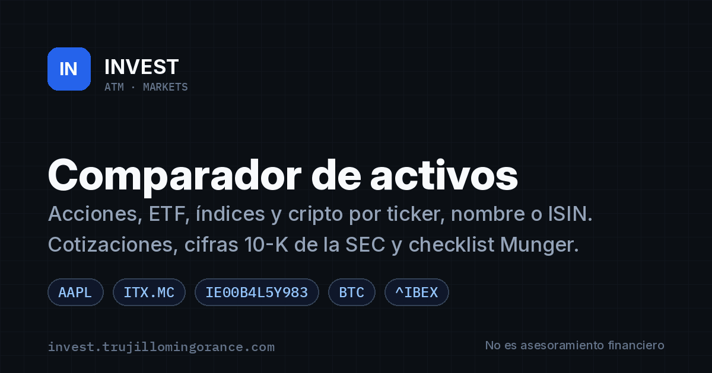
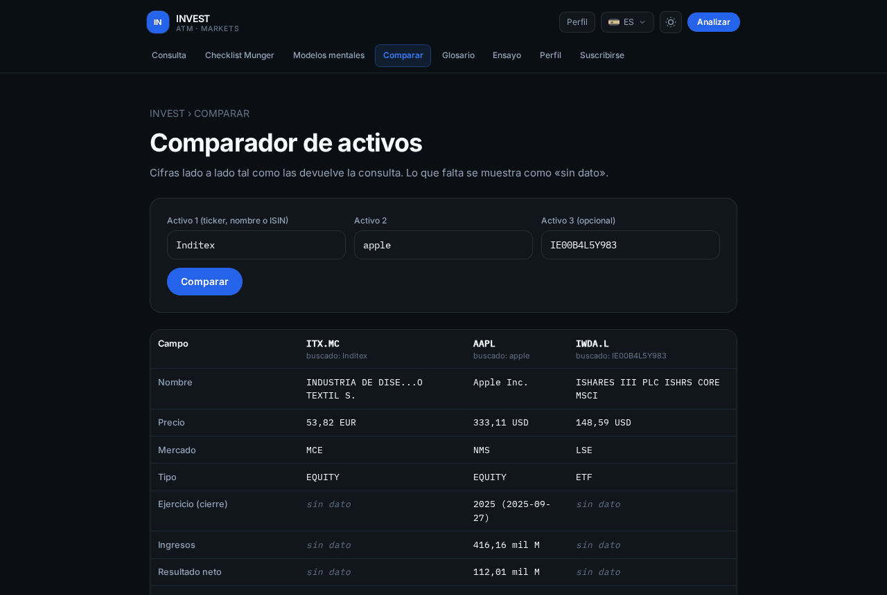

<p align="center">
  
</p>

# INVEST · Comparador de activos e investigación de inversiones

**INVEST** es una plataforma abierta de **investigación y comparación de inversiones**: consulta y compara
**acciones, ETF, índices, criptomonedas y materias primas** por **ticker, nombre o ISIN**, con **cotizaciones**,
cifras de los informes anuales **10-K de la SEC**, un **checklist Munger** transparente y el boletín
**Markets Digest**.

🌐 **Web:** <https://invest.trujillomingorance.com> · **Comparador:** <https://invest.trujillomingorance.com/comparar/>

> ⚠️ Información general y educativa. **No es asesoramiento financiero** ni una recomendación personalizada
> (ver [Aviso](#aviso-legal)).

<p align="center"></p>

**English summary.** INVEST is an open investment research and asset comparison platform (Spanish-first).
Look up and compare stocks, ETFs, indices, crypto and commodities by ticker, company name or ISIN, with live
quotes, SEC 10-K figures, a transparent Munger checklist and the *Markets Digest* newsletter. The public site
runs on a Cloudflare Worker; the repo also contains a TypeScript market-data backend (Fastify / Workers) and a
Next.js terminal. General information only, not financial advice.

## Funcionalidades

- **Comparador de activos** (`/comparar/`): 2 o 3 activos lado a lado (precio, mercado, tipo, ingresos,
  resultado neto, márgenes, flujo de caja libre, efectivo y deuda). Sin ranking ni recomendaciones.
- **Búsqueda tolerante**: tickers (`AAPL`, `SAN.MC`, `BRK.B`), nombres en castellano o inglés, con o sin tildes
  (`Inditex`, `telefónica`, `apple`), **ISIN** (`IE00B4L5Y983`, `US0378331005`), ETF UCITS sin sufijo
  (`VWCE`, `IWDA`, `CSPX`), índices (`S&P 500`, `IBEX 35`), cripto (`BTC`, `bitcoin`; precio en EUR cuando existe el par, si no en USD indicado) y materias primas
  (`oro`, `brent`). Sugerencias mientras escribes.
- **Consulta y checklist Munger**: margen neto ≥ 15 %, margen FCF ≥ 10 % y efectivo ≥ deuda a largo plazo,
  calculados solo con cifras 10-K (no se inventan datos).
- **Modelos mentales, glosario y ensayos** educativos.
- **Markets Digest / INVEST Notas**: suscripción con doble opt-in (Brevo), Cloudflare Turnstile, honeypot y
  límite de peticiones.
- **SEO**: títulos y descripciones por página, canonical, Open Graph, Twitter card, JSON-LD, `sitemap.xml`
  y `robots.txt`.

## Arquitectura

| Componente | Ruta | Qué hace | Despliegue |
| --- | --- | --- | --- |
| **Web pública** (en producción) | [`web/public-worker/`](web/public-worker/README.md) | Páginas pre-renderizadas, `/api/quote`, `/api/search`, `/api/subscribe`, sitemap/robots. Un único módulo ES generado en `dist/worker.js`. | Cloudflare Worker `invest` (ruta `invest.trujillomingorance.com/*`) |
| Backend de datos de mercado | `src/` | Resolución global de identificadores, normalización IFRS/US GAAP, scoring determinista y síntesis cualitativa con LLM (EODHD → FMP → OpenBB → fixtures). | Node (Fastify, Docker) o edge (`src/edge/`, `functions/`) |
| Terminal Next.js | `web/` | UI tipo terminal (React 19 / Next.js 15) sobre el backend. | Exportación estática + Worker con assets ([`wrangler.example.toml`](wrangler.example.toml) raíz, solo plantilla) |

Datos de la web pública: cotizaciones y búsqueda de símbolos de **Yahoo Finance**, cifras anuales de **SEC EDGAR
(XBRL 10-K)**. Las respuestas de error distinguen «sin resultado» de «fuente de datos no disponible».

> ℹ️ Producción sirve el bundle de `web/public-worker/`. Workers Builds (`npm run build` y
> `npx wrangler deploy` en la raíz) usa [`wrangler.toml`](wrangler.toml): Worker `invest`,
> el KV `SUBSCRIBERS` y el dominio `invest.trujillomingorance.com`. `keep_vars` deja las
> variables del panel. Los secretos no están en el archivo. El terminal Next.js sigue en
> [`wrangler.example.toml`](wrangler.example.toml): cópiala a `wrangler.terminal.toml` con
> **otro** nombre de Worker y ejecuta `npm run deploy:terminal`.

## Puesta en marcha

Requisitos: Node.js ≥ 20 (22 recomendado) y npm.

```bash
# Web pública (Worker)
cd web/public-worker
npm ci
cp build.local.env.example build.local.env   # TURNSTILE_SITEKEY (clave pública del widget)
npm run build                                # -> dist/worker.js
npm test                                     # resolución de símbolos + smoke test con mocks
npx wrangler dev -c wrangler.toml            # tras copiar wrangler.example.toml (ver abajo)

# Backend
cp .env.example .env
npm install
npm test
npm run dev                                  # http://127.0.0.1:8787

# Terminal Next.js
cd web && npm install && npm run dev         # http://127.0.0.1:3000
```

Sin claves de proveedores el backend responde con fixtures deterministas (`ENABLE_DEMO_FIXTURES=true`).
También: `docker compose up --build`.

## Variables de entorno

### Web pública (`web/public-worker`)

| Nombre | Tipo | Uso |
| --- | --- | --- |
| `SUBSCRIBERS` | KV | Límite de peticiones, enfriamiento por correo e ids de Brevo en caché (`<KV_NAMESPACE_ID>`). |
| `BREVO_API_KEY` | secreto | Necesario para activar el formulario de suscripción. |
| `TURNSTILE_SECRET` | secreto | Verificación de Turnstile en el servidor. |
| `TURNSTILE_SITEKEY` | build | Clave pública de Turnstile (se incrusta en el bundle). |
| `BREVO_LIST_MARKETS`, `BREVO_LIST_INVEST` | var | Ids de las listas «Markets Digest» e «INVEST Notas» (si faltan, se buscan o crean por nombre). |
| `DOI_REPLY_TO` | var | Reply-To de la plantilla de doble opt-in (solo al crearla). |
| `BREVO_DOI_TEMPLATE_ID` | var, opcional | Fija la plantilla de doble opt-in. |
| `SUB_TEST_TOKEN` + `SUB_TEST_EMAIL` | temporal | Prueba extremo a extremo sin Turnstile; bórralos tras la prueba. |

Plantillas sin valores reales: [`wrangler.example.toml`](web/public-worker/wrangler.example.toml),
[`.dev.vars.example`](web/public-worker/.dev.vars.example) y
[`build.local.env.example`](web/public-worker/build.local.env.example).

### Backend (`.env`, ver [`.env.example`](.env.example))

`PORT`, `HOST`, `LOG_LEVEL`, `EODHD_API_TOKEN`, `FMP_API_KEY`, `OPENBB_BASE_URL`, `OPENBB_API_KEY`, `REDIS_URL`
(opcional), `CACHE_TTL_*`, `ENABLE_DEMO_FIXTURES`, `HTTP_TIMEOUT_MS`, `HTTP_RETRIES`, `XAI_API_KEY`, `XAI_MODEL`,
`XAI_BASE_URL`, `XAI_TIMEOUT_MS` y `RESEND_API_KEY` (`POST /api/newsletter`; sin ella responde 503).

Nunca subas claves al repositorio: `.env`, `.dev.vars`, `wrangler.terminal.toml` y `build.local.env` están en
`.gitignore`. `wrangler.toml` de la raíz no lleva secretos.

## Despliegue

**Web pública** (Cloudflare Worker `invest`):

```bash
npm run build          # tsc del backend + web/public-worker/dist/worker.js
npx wrangler deploy    # Worker `invest` (misma orden que Workers Builds)
```

Los secretos se ponen una vez y el deploy no los borra:

```bash
npx wrangler secret put BREVO_API_KEY
npx wrangler secret put TURNSTILE_SECRET
```

**Terminal Next.js** (opcional, no es la web de producción): `cp wrangler.example.toml wrangler.terminal.toml`, pon un nombre
de Worker y una ruta propios y ejecuta `npm run deploy:terminal`.

**Backend:** `npm run build && npm start` o la imagen Docker (`Dockerfile`, puerto 8787).

## API pública

| Endpoint | Descripción |
| --- | --- |
| `GET /api/quote?q=<ticker, nombre o ISIN>` | Cotización + cifras 10-K. Incluye `resolved` (cómo se interpretó la consulta) y `alternatives`. `404 not_found` con `suggestions`, `502 upstream_unavailable` si la fuente falla. |
| `GET /api/search?q=` | Sugerencias de símbolos (alias, nombres, ISIN). |
| `POST /api/subscribe` · `GET /api/subscribe/status` | Suscripción con doble opt-in. |

Backend: `GET /api/v1/asset/:identifier`, `/api/v1/resolve/:identifier`, `/api/v1/score/:identifier`,
`/api/v1/analysis/:identifier`, `/api/v1/search?q=`, `/api/v1/universe`, `POST /api/newsletter`, `GET /health`.

## Estructura del proyecto

```
.
├── web/public-worker/   Web pública (Cloudflare Worker): src/ (páginas, scripts, worker) y build.mjs
├── src/                 Backend TypeScript: providers, domain, scoring, llm, routes, edge
├── web/                 Terminal Next.js (app/, components/, lib/)
├── functions/           Cloudflare Pages Functions que reutilizan src/edge
├── tests/               Tests del backend (Vitest)
├── scripts/             Utilidades (snapshot de símbolos)
└── docs/                Imágenes del README y de Open Graph
```

## Aviso legal

INVEST publica **información general y educativa** sobre instrumentos financieros a partir de fuentes públicas.
**No constituye asesoramiento en materia de inversión**, recomendación personalizada ni oferta, en el sentido de
la Directiva 2014/65/UE (**MiFID II**) y de la Ley 6/2023 de los Mercados de Valores y de los Servicios de
Inversión. El titular **no está registrado en la CNMV** como empresa de servicios de inversión. Las
rentabilidades pasadas no garantizan rentabilidades futuras; puedes perder todo el capital invertido. Los datos
pueden estar retrasados, incompletos o ser erróneos.

## Licencia

[MIT](LICENSE) © 2026 Alberto Trujillo Mingorance. Las marcas y datos de terceros pertenecen a sus titulares.

## Contacto

- General: [soporte@trujillomingorance.com](mailto:soporte@trujillomingorance.com)
- Seguridad: [security@trujillomingorance.com](mailto:security@trujillomingorance.com) (ver [SECURITY.md](SECURITY.md))
